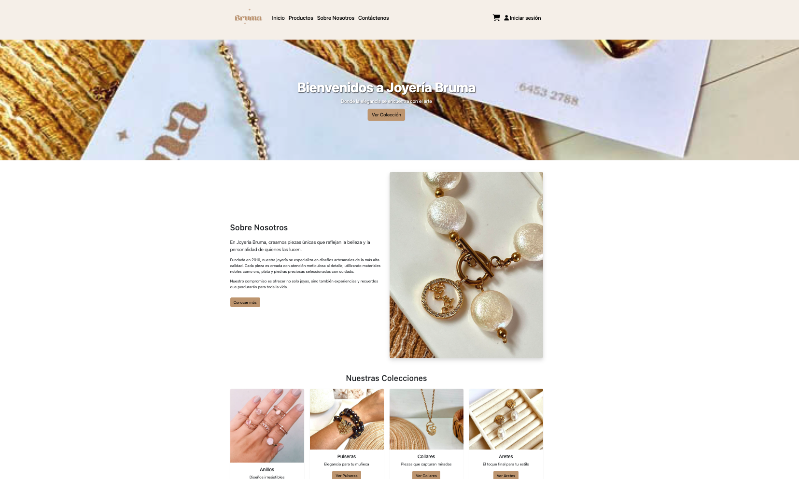
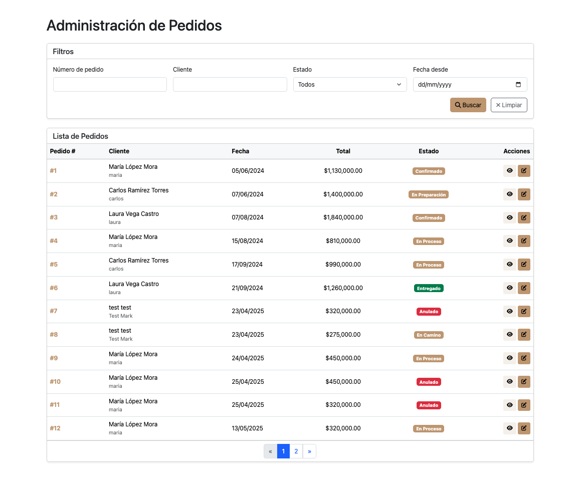
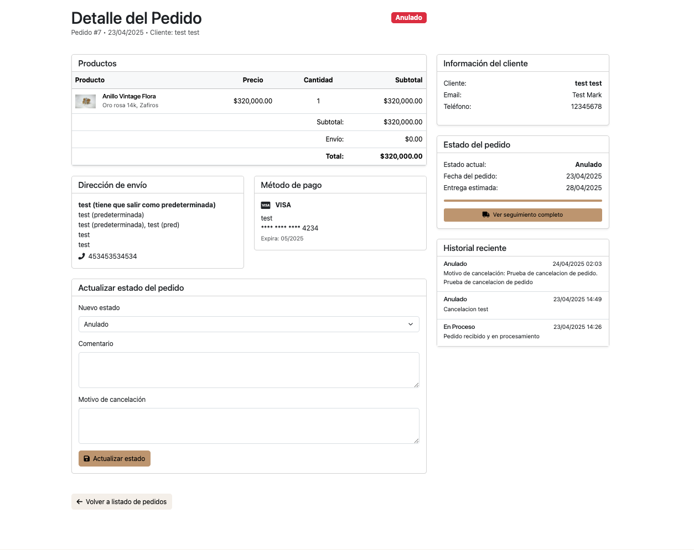
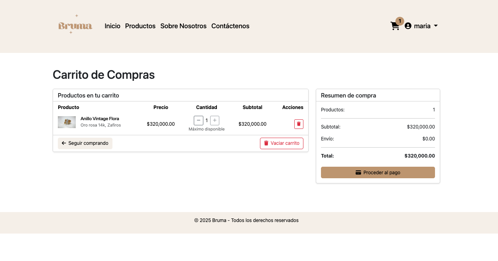
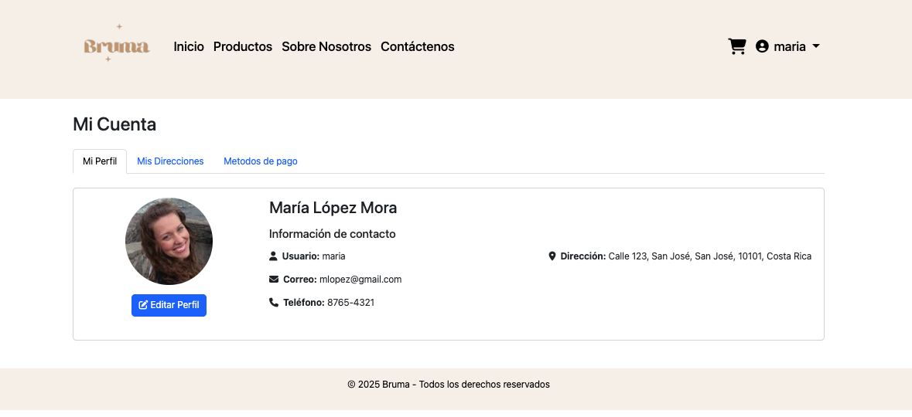
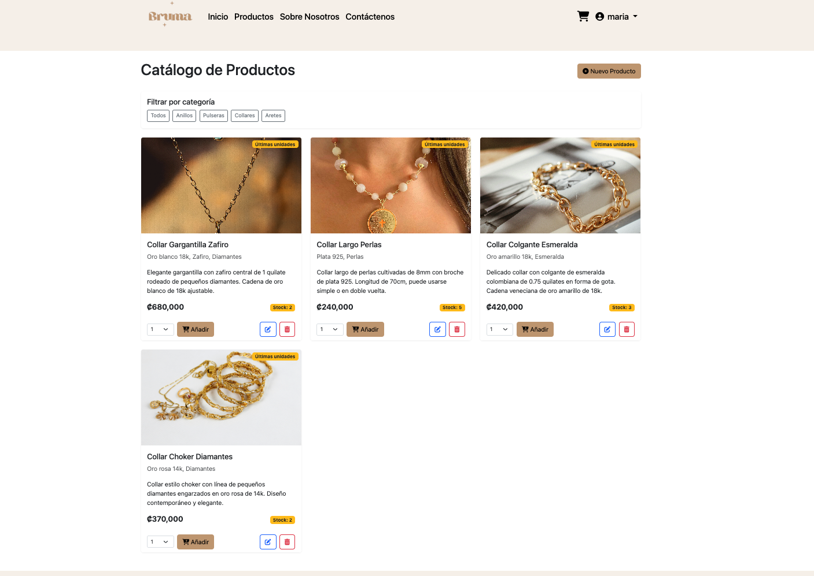

# Tienda Bruma - Proyecto Final del Curso de Desarrollo Web

## 📝 Descripción

Tienda Bruma fue mi proyecto final para el curso de desarrollo web en la Universidad Fidélitas. Esta página web está inspirada en el emprendimiento real de la joyería Bruma. 
La finalidad del proyecto era mostrar cómo una página web podría ayudar al emprendimiento a darse a conocer y también ser una herramienta para que los clientes conecten con la marca. 
Además, se diseñó como una solución integral capaz de manejar tareas como el manejo de inventarios, gestión de envíos, reseñas y más.

Doy crédito total al emprendimiento bruma, por acá dejo su perfil de Instagram para que le den un vistazo: https://www.instagram.com/brumajewelry_cr/

## 🛠️ Tecnologías Utilizadas

- **Backend**: Spring Boot
- **Base de Datos**: MySQL
- **Almacenamiento/Manejo de imagenes**: Firebase
- **Arquitectura/Patrón**: Modelo-Vista-Controlador (MVC)
- **Frontend**: HTML, CSS, JavaScript, Bootstrap

## ⭐ Características Destacadas

### Vistas de Usuario, Vendedor y Administrador
Para esta página existen 3 tipos roles (usuario, vendedor y administrador) y dependiendo del rol, el usuario va a tener ciertas opciones disponibles. Por ejemplo, en la página productos, los usuarios pueden ver el catálogo de productos de la página y agregar productos al carrito. 
Mientras que los vendedores y los administradores, en la página de productos, estos tiene la opción de agregar, modificar y eliminar productos

### Sistema de Gestión de Pedidos
Una de las funcionalidades que más me gusto desarrollar fue el sistema de manejo de pedidos. Los vendedores y administradores tienen la posibilidad de ver todos los pedidos realizados por los clientes. 
Para facilitar el manejo de pedidos, se crearon las opciones de búsqueda avanzada que permiten filtrar pedidos por:
- Número de pedido
- Cliente
- Estado actual
- Fecha de creación

Al seleccionar un pedido específico, se puede acceder a una vista detallada con toda la información de la compra. 
Una característica destacada es la capacidad para que administradores y vendedores dejen notas en el pedido, creando así un sistema de actualizaciones en tiempo real. 
Esto permite que los clientes estén constantemente informados sobre el estado exacto de su pedido, mejorando significativamente la experiencia de usuario y la comunicación entre la tienda y sus clientes.

## 📸 Capturas de Pantalla
Por acá dejaré algunas capturas de pantalla del proyecto bruma. En caso de querer ver más imágenes, hay una carpeta dentro del proyecto llamado "screenshots". Aquí podrán ver más imágenes sobre como luce el proyecto:

### Vista de Cliente

#### Carrito de Compras

#### Gestión de mi Perfil

### Vista de Administrador
#### Catálogo de Productos

#### Gestión de reseñas

